# 🧪 Lab: Building a Healthcare RAG Pipeline using Vibe Coding
*Author: Ved Mishra - 9/22/2025 | Optimized for Learning & Discovery*

## 🎯 What You'll Build

By the end of this lab, you'll have a **working healthcare knowledge system** that can answer medical questions like:
- *"What are normal blood pressure ranges?"*
- *"What blood sugar levels indicate diabetes?"*
- *"What lifestyle changes prevent heart disease?"*

**Your Achievement**: A complete RAG (Retrieval-Augmented Generation) system built entirely through **vibe coding** - where you describe what you want and AI builds it for you.

---

## 🤔 What is Vibe Coding?

**Traditional Coding:**
```python
# 50+ lines of manual Azure connection code
from azure.storage.blob import BlobServiceClient
from azure.core.credentials import AzureKeyCredential
# ... complex manual setup ...
```

**Vibe Coding:**
```
Create a script that connects to Azure and uploads healthcare PDFs with progress tracking and error handling.
```
→ *AI generates the complete working code!*

**Key Insight**: You become an **AI conductor** - orchestrating systems through conversation rather than writing every line of code. Your workflow changes from writing every line to a powerful new loop: **prompt → generate → review → refine → debug**.

**The Reality**: Vibe coding isn't magic - it's an iterative conversation where you:
1. **Prompt**: Describe what you want clearly and specifically
2. **Generate**: AI creates a strong first draft
3. **Review**: You examine the code and identify gaps or issues  
4. **Refine**: Guide the AI to improve specific aspects
5. **Debug**: Test and iterate until it works perfectly

This approach lets you focus on **system design** and **problem-solving** instead of syntax and boilerplate. **The more specific your prompt, the better the AI's first draft will be.**

---

## 🏗️ What You're Building (Architecture Overview)

Here's the simple system you'll create:

```mermaid
flowchart TD
    A[📄 Healthcare PDFs] --> B[☁️ Azure Blob Storage]
    B --> C[🔍 Azure AI Search]
    D[❓ Your Question] --> E[🤖 RAG App]
    C --> E
    E --> F[💬 Answer from GPT-4o-mini]
    
    style A fill:#e1f5fe
    style C fill:#f3e5f5
    style F fill:#e8f5e8
```



**The Flow:**
1. **Upload**: Store your healthcare documents in Azure Blob Storage
2. **Index**: Convert documents into searchable AI embeddings in Azure AI Search  
3. **Query**: Your question finds relevant chunks, GPT generates an answer

---

## 📋 Before You Start

### ✅ Quick Setup Checklist
- **VS Code**: [Download](https://code.visualstudio.com/)
- **GitHub Copilot**: [Internal Resource](https://aka.ms/github/copilot), [Setup Guide](https://docs.github.com/en/copilot/getting-started-with-github-copilot)
- **Python 3.11+**: [Download](https://www.python.org/downloads/)
- **Azure Account**: [Get Free Monthly Credits (for Microsoft Employees)](https://my.visualstudio.com/) or [Public Free Trial](https://azure.microsoft.com/free/)
- **Azure CLI**: [Install Guide](https://learn.microsoft.com/cli/azure/install-azure-cli)

### 🔑 Azure Subscription Options
**Recommended**: Use your own free trial subscription or with monthly Azure credits for the full learning experience of resource management and cost awareness.

### 🔐 Security Note
For this lab, we'll use `.env` files for simplicity. In production Microsoft systems, always use **Azure Key Vault** for secrets management and follow our enterprise security guidelines.

### 💡 What Each Tool Does
- **Azure Blob Storage** = Cloud file cabinet for your healthcare documents
- **Azure AI Search** = Smart database that finds similar content using AI
- **Azure OpenAI** = AI that creates embeddings and generates answers
- **LangChain** = Helper that splits documents into manageable chunks

### ⏱️ Time & Cost
- **Beginner Track**: 30 minutes | **$3-5 Azure costs**
- **Intermediate Track**: 60 minutes | **$5-10 Azure costs**
- **Advanced Track**: 90 minutes | **$10-15 Azure costs**

---

## 🚀 Track A: "Hello RAG!" (Perfect for Beginners)

*Get your first RAG system working in 30 minutes with early wins and simple prompts*

### 📍 Progress Tracker
```
[🎯] Step 1: Setup & First Success
[ ] Step 2: Create Simple Documents  
[ ] Step 3: Build Basic RAG
[ ] Step 4: Test Your System
[ ] 🎉 Celebrate: You built RAG with AI!
```

### Step 1: Quick Environment Setup (5 minutes)

💡 **What We're Doing**: Setting up your workspace and getting Azure ready

**Create Your Workspace:**
1. Create folder: `C:\dev\my-first-rag`
2. Open in VS Code: `File → Open Folder`
3. Open terminal: `Ctrl + \``

**Simple Copilot Prompt:**
```
Create a basic Python setup script for a healthcare RAG project that:
1. Creates a virtual environment
2. Installs essential packages: azure-storage-blob, azure-search-documents, openai, langchain, python-dotenv
3. Creates a simple project structure: docs/, src/, .env
4. Shows success messages for each step

Make it beginner-friendly with clear progress indicators.
```

**Execute & Verify:**
- Run the generated script
- **✅ Early Win**: You should see success messages and folders created

### Step 2: Simple Azure Setup (8 minutes)

💡 **What We're Doing**: Creating your cloud services with one prompt

**Copilot Prompt:** 
```
Create a PowerShell script that sets up basic Azure resources for RAG:
1. Login to Azure and list subscriptions
2. Create resource group "rg-labs-rag" in eastus2
3. Create storage account with name "stlabsrag" + random suffix and "health-docs" container
4. Create Azure AI Search service with name "srch-labs-rag" + random suffix (use free tier)
5. Create Azure OpenAI with name "aoai-labs-rag" and deploy text-embedding-3-small and gpt-4o-mini models
6. Generate .env file with all keys and endpoints
7. Print a success summary with resource names and estimated monthly costs

Include helpful error messages and verification steps.
If resources already exist with these names, append a timestamp or random number.
```

**🔧 Quick Test:**
- Run the script
- **✅ Early Win**: Check Azure portal - you should see your new resources!

### Step 3: Generate Healthcare Documents (5 minutes)

💡 **What We're Doing**: Creating realistic medical content for our system

**Copilot Prompt:**
```
Create a simple Python script that generates 2 realistic healthcare PDFs:

Document 1 - Blood Pressure Guide (500 words):
- Normal: <120/80 mmHg
- Elevated: 120-129/<80 mmHg  
- Stage 1: 130-139/80-89 mmHg
- Stage 2: ≥140/90 mmHg
- Include lifestyle recommendations

Document 2 - Diabetes Basics (500 words):
- Normal blood sugar: <100 mg/dL fasting
- Prediabetes: 100-125 mg/dL fasting
- Diabetes: ≥126 mg/dL fasting
- Include management tips

Use reportlab to create actual PDFs in docs/ folder.
Include progress messages and file verification.
```

**✅ Quick Verification:**
- Check `docs/` folder for 2 PDF files
- Open one PDF to verify content looks medical and realistic

### Step 4: Build Your RAG System (15 minutes)

💡 **What We're Doing**: Creating your RAG pipeline step-by-step so you understand each component

#### Step 4a: Create the Upload Script (5 minutes)

**💡 Why This First**: Before we can search documents, we need to get them into Azure Blob Storage. This is the **data ingestion** part of our pipeline.

**Copilot Prompt:**
```
Create a Python script named upload.py that:
1. Connects to Azure Blob Storage using credentials from .env file
2. Uploads all PDFs from the local 'docs/' folder to the container
3. Shows a progress message for each file uploaded
4. Confirms successful uploads with file names and sizes
5. Handles errors gracefully with helpful messages

Make it simple and well-commented for learning purposes.
```

**🔧 Quick Test**: Run `python upload.py` - you should see your PDFs being uploaded to Azure.

#### Step 4b: Create the Indexing Script (5 minutes)

**💡 Why This Second**: Now that files are in the cloud, we need to make them **searchable**. This script converts documents into AI-friendly "chunks" and "embeddings" (vectors that represent meaning).

**Key Concepts**:
- **Chunking**: Breaking a long document into searchable paragraphs (~300 characters each)
- **Embeddings**: Converting text into numbers so AI can find similar concepts, not just keywords
- **Vector Search**: Finding chunks that are conceptually similar to your question

**Copilot Prompt:**
```
Create an index.py script that:
1. Downloads PDFs from our Azure blob container
2. Uses LangChain's PyPDFLoader to extract text from PDFs
3. Splits text into 300-character chunks with 50-character overlap (preserves context)
4. Uses Azure OpenAI embedding model to create vector representations
5. Stores chunks and their vectors in Azure AI Search index
6. Shows progress: "Processing doc 1/2", "Created 15 chunks", "Uploaded to search index"
7. Displays final summary: total chunks indexed

Include clear error handling and explanatory comments.
```

**🔧 Quick Test**: Run `python index.py` - you should see chunks being created and uploaded to your search index.

#### Step 4c: Create the Query Script (5 minutes)

**💡 Why This Last**: This is where the magic happens! This script performs **Retrieval-Augmented Generation** - it finds relevant chunks and uses them to generate accurate answers.

**The RAG Process**:
1. Convert your question into an embedding (same format as document chunks)
2. Find the most similar chunks using vector search  
3. Feed those chunks + your question to GPT-4o-mini
4. Generate an answer based on your specific documents

**Copilot Prompt:**
```
Create a query.py script that:
1. Takes a user question from command line input
2. Creates an embedding for the question using Azure OpenAI
3. Searches Azure AI Search to find top 3 most relevant document chunks
4. Creates a prompt combining the user question with retrieved chunks
5. Sends this enhanced prompt to GPT-4o-mini for answer generation
6. Displays the answer with source attribution (which documents were used)
7. Includes medical disclaimer: "This is for educational purposes only"

Show the relevance scores and chunk sources for transparency.
```

**🔧 Quick Test**: Run `python query.py` and ask "What are normal blood pressure ranges?"

### Step 5: Test Your Complete RAG System (2 minutes)

**Run Your Pipeline:**
```powershell
python upload.py    # Step 1: Upload documents to cloud
python index.py     # Step 2: Create searchable AI index  
python query.py     # Step 3: Start asking questions!
```

**Test Questions:**
- "What are normal blood pressure ranges?"
- "What blood sugar levels indicate diabetes?"
- "What lifestyle changes prevent heart disease?"

**✅ Success Criteria:**
- You get answers with source references
- Response time under 10 seconds
- Medical disclaimer included
- Relevance scores visible

### 🎉 Congratulations!

You just built a complete RAG system using vibe coding! Your system can now:
- ✅ Store healthcare documents in the cloud
- ✅ Understand and search medical content
- ✅ Answer questions with proper sources
- ✅ Handle errors gracefully

### 🔄 Level Up: Refactoring for Readability (Optional - 5 minutes)

💡 **What We're Doing**: Our three scripts work great, but for real projects, we'd organize them better. Let's use AI to refactor our code into a cleaner structure - this shows how vibe coding helps with code improvement, not just initial creation.

**The Transformation:**


**Copilot Prompt:**
```
Take the logic from my upload.py, index.py, and query.py files and refactor them into a single Python class called HealthcareRAGPipeline in a new file pipeline.py. 

The class should have these methods:
- __init__(self) - loads configuration from .env
- upload_documents(self) - uploads PDFs to blob storage  
- create_index(self) - processes documents and creates search index
- ask_question(self, question) - performs RAG query and returns answer

Include proper error handling, logging, and docstrings. Make it professional and maintainable.
```

**💡 Why This Matters**: This demonstrates a key vibe coding skill - using AI not just for initial development, but for **code quality improvement**. In real projects, you'll constantly refactor and enhance your AI-generated code.

**🤔 Reflection Questions:**
- What did the AI understand from your prompts?
- How is this different from manual coding?
- What would you ask for next?

---

## 🏗️ Track B: Production-Ready RAG (For Intermediate Learners)

*Build an enterprise-grade system with monitoring, testing, and advanced features*

### Prerequisites
- ✅ Completed Track A or familiar with basic RAG concepts
- ✅ Comfortable with VS Code and terminal operations

### Enhanced Architecture


### Step 1: Enhanced Project Structure (5 minutes)

**Copilot Prompt:**
```
Create a professional RAG project structure with:

src/
├── config/
│   ├── settings.py (environment management)
│   └── azure_config.py (service configurations)
├── services/
│   ├── document_service.py (PDF processing)
│   ├── embedding_service.py (vector operations) 
│   ├── search_service.py (Azure AI Search)
│   └── rag_service.py (query orchestration)
├── utils/
│   ├── logging_utils.py (structured logging)
│   └── error_handling.py (custom exceptions)
└── main.py (CLI interface)

tests/
├── unit/ (component tests)
├── integration/ (end-to-end tests)
└── data/ (test fixtures)

Include __init__.py files, comprehensive .gitignore, and README.md.
Add type hints and docstrings throughout.
```

### Step 2: Enhanced Document Processing (10 minutes)

**Copilot Prompt:**
```
Create an advanced document processing system in src/services/document_service.py:

Features:
1. Generate 4 comprehensive healthcare documents (1000+ words each):
   - Diabetes Management Guidelines
   - Hypertension Treatment Protocols  
   - Heart Disease Prevention
   - Cardiovascular Risk Assessment

2. Advanced PDF processing:
   - Metadata extraction (title, author, creation date)
   - Smart chunking (preserve paragraphs, respect medical terminology)
   - Chunk overlapping with context preservation
   - Quality validation (minimum content length, medical terminology check)

3. Error handling and logging:
   - Detailed progress tracking
   - Retry logic for transient failures
   - Comprehensive error messages
   - Performance metrics collection

Include async/await for better performance.
```

### Step 3: Advanced RAG Pipeline (15 minutes)

**Copilot Prompt:**
```
Create a production-ready RAG pipeline with these advanced features:

1. Smart Query Processing:
   - Query preprocessing (medical terminology normalization)
   - Multi-vector search strategies
   - Result ranking and relevance scoring
   - Query expansion for better matches

2. Response Generation:
   - Context-aware prompting
   - Source attribution with confidence scores
   - Medical safety guardrails
   - Response quality validation

3. Performance Features:
   - Connection pooling for Azure services
   - Caching for frequent queries
   - Batch processing for efficiency
   - Rate limiting and throttling

4. Monitoring Integration:
   - Response time tracking
   - Cost monitoring
   - Error rate measurement
   - Usage analytics

Include comprehensive error handling and detailed logging.
```

### Step 4: Testing & Validation (10 minutes)

**Copilot Prompt:**
```
Create a comprehensive testing suite:

1. Unit Tests (tests/unit/):
   - Document processing accuracy
   - Embedding generation validation  
   - Search functionality testing
   - Response quality checks

2. Integration Tests (tests/integration/):
   - End-to-end pipeline testing
   - Azure service connectivity
   - Performance benchmarking
   - Error scenario handling

3. Healthcare-Specific Tests:
   - Medical accuracy validation
   - Source attribution verification
   - Safety disclaimer presence
   - Response appropriateness

Test Data:
- 20 healthcare questions covering different medical domains
- Expected answer patterns
- Performance benchmarks (response time <5 seconds)
- Quality metrics (relevance scores >0.7)

Include automated test reporting and pass/fail criteria.
```

### Step 5: Monitoring & Analytics (10 minutes)

**Copilot Prompt:**
```
Create a monitoring dashboard system:

1. Real-time Metrics:
   - Query response times
   - Embedding generation speed
   - Search relevance scores
   - Error rates and types

2. Cost Tracking:
   - Azure OpenAI token usage
   - Storage costs
   - Search service utilization
   - Daily/monthly cost projections

3. Usage Analytics:
   - Popular queries and patterns
   - Document access frequency
   - User satisfaction metrics
   - System health indicators

4. Alerting System:
   - Performance degradation alerts
   - Error threshold notifications
   - Cost overrun warnings
   - Service availability monitoring

Include visual dashboards with charts and real-time updates.
```

### Step 6: Deployment & Production (10 minutes)

**Copilot Prompt:**
```
Create production deployment tools:

1. Environment Management:
   - Development, staging, production configs
   - Secure credential management
   - Environment-specific settings
   - Configuration validation

2. Deployment Scripts:
   - Automated Azure resource provisioning
   - Application deployment pipeline
   - Database migration scripts
   - Health check verification

3. Operational Tools:
   - Log aggregation and analysis
   - Performance profiling
   - Backup and recovery procedures
   - Scaling recommendations

4. Documentation:
   - API documentation
   - Operational runbooks
   - Troubleshooting guides
   - Architecture decision records

Include Docker containerization and CI/CD pipeline templates.
```

---

## 🔬 Track C: Advanced Enterprise RAG (For Advanced Users)

*Add security, compliance, MLOps, and enterprise integration features*

### Prerequisites
- ✅ Completed Track B
- ✅ Understanding of enterprise security concepts
- ✅ Familiarity with MLOps practices

### Enterprise Features

#### Security & Compliance

**Copilot Prompt:**
```
Implement enterprise security features:

1. Authentication & Authorization:
   - Azure AD integration
   - Role-based access control (RBAC)
   - API key rotation automation
   - Multi-factor authentication support

2. Data Protection:
   - Encryption at rest and in transit
   - PII detection and redaction
   - Data loss prevention (DLP)
   - Audit logging for compliance

3. Security Scanning:
   - Vulnerability assessment
   - Dependency scanning
   - Code security analysis
   - Infrastructure security validation

4. Compliance Features:
   - HIPAA compliance controls
   - SOC 2 audit trails
   - Data retention policies
   - Privacy impact assessments

Include security testing and penetration testing recommendations.
```

#### MLOps Integration

**Copilot Prompt:**
```
Add MLOps capabilities for production AI systems:

1. Model Management:
   - Model versioning and lifecycle
   - A/B testing for prompt variations
   - Performance monitoring and drift detection
   - Automated model retraining triggers

2. Data Pipeline Management:
   - Data validation and quality checks
   - Feature store integration
   - Data lineage tracking
   - Schema evolution management

3. Experiment Tracking:
   - MLflow integration
   - Experiment comparison and analysis
   - Hyperparameter optimization
   - Model performance benchmarking

4. Production Monitoring:
   - Model performance degradation alerts
   - Data drift detection
   - Concept drift monitoring
   - Feedback loop integration

Include integration with Azure Machine Learning and MLflow.
```

#### Enterprise Integration

**Copilot Prompt:**
```
Create enterprise integration capabilities:

1. API Gateway:
   - RESTful API with OpenAPI documentation
   - Rate limiting and throttling
   - API versioning and backward compatibility
   - Request/response transformation

2. Event-Driven Architecture:
   - Azure Service Bus integration
   - Event sourcing patterns
   - Saga pattern for distributed transactions
   - Dead letter queue handling

3. Data Connectors:
   - SharePoint integration
   - SQL Server connectivity
   - Active Directory synchronization
   - Legacy system adapters

4. Scalability Features:
   - Auto-scaling based on demand
   - Load balancing strategies
   - Circuit breaker patterns
   - Graceful degradation

Include microservices architecture and container orchestration.
```

---

## 🔍 Common Issues & Solutions

### When Your Code Has Import Errors
**Ask Copilot:**
```
Fix the import statements in this code and ensure all required packages are in requirements.txt with correct versions.
```

### When Azure Authentication Fails
**Ask Copilot:**
```
Debug Azure authentication issues in this code. Add proper error handling and detailed logging for troubleshooting.
```

### When Search Results Are Poor
**Ask Copilot:**
```
Optimize the vector search configuration and chunking strategy. Improve relevance scoring and add query preprocessing.
```

### When Performance Is Slow
**Ask Copilot:**
```
Profile performance bottlenecks in this RAG system. Add caching, connection pooling, and async processing.
```

---

## 🎯 Validation Checklist

### Track A (Beginner)
- [ ] Azure resources created successfully (visible in Azure Portal)
- [ ] Healthcare documents generated and stored (2 PDFs in docs/ folder)
- [ ] Basic RAG pipeline answers medical questions accurately
- [ ] System responds in under 10 seconds per query
- [ ] Sources are properly attributed (e.g., "Answer based on: Blood Pressure Guide.pdf")
- [ ] Relevance scores visible (e.g., "Retrieved chunk with score: 0.85")
- [ ] Medical disclaimer appears with each answer

### Track B (Intermediate)  
- [ ] Professional project structure implemented (src/ folders created)
- [ ] Advanced document processing working (4 comprehensive medical documents)
- [ ] Production-ready RAG pipeline deployed (class-based architecture)
- [ ] Comprehensive testing suite passing (all unit and integration tests green)
- [ ] Monitoring and analytics functional (performance metrics displayed)
- [ ] Error handling graceful (helpful messages, not crashes)

### Track C (Advanced)
- [ ] Security and compliance features implemented (RBAC, encryption working)
- [ ] MLOps pipeline operational (model versioning, drift detection active)
- [ ] Enterprise integration capabilities deployed (API endpoints responding)
- [ ] Performance meets production requirements (< 3 second response times)
- [ ] Documentation complete and accurate (API docs, runbooks created)

---

## 🧹 Resource Cleanup (Important!)

💡 **Why We Do This**: To avoid unnecessary Azure costs, it's a Microsoft best practice to delete all resources when finished with a project. This is especially important for engineers working with company Azure subscriptions.

### ⚠️ Safe Manual Cleanup (Recommended)

**Step 1: Verify Your Resources**
```powershell
# List YOUR specific resource group (replace <your-alias> with your actual alias)
az group show --name "rg-<your-alias>-rag" --output table

# List all resources in YOUR resource group to confirm they're yours
az resource list --resource-group "rg-<your-alias>-rag" --output table
```

**Step 2: Check Costs Before Deletion**
- Go to [Azure Portal](https://portal.azure.com) → Cost Management
- Filter by your resource group to see actual costs
- Screenshot for your records if needed

**Step 3: Safe Deletion**
```powershell
# Only delete YOUR resource group (double-check the name!)
az group delete --name "rg-<your-alias>-rag" --yes
```

### 🤖 Alternative: AI-Generated Cleanup Script

**Only if you prefer automation - Copilot Prompt:**
```
Create a PowerShell cleanup script that:
1. Prompts user to enter their Microsoft alias
2. Lists resources in "rg-{alias}-rag" resource group specifically  
3. Shows estimated costs for these resources
4. Requires user to type "DELETE rg-{alias}-rag" exactly to confirm
5. Validates the resource group name contains their alias
6. Deletes only that specific resource group
7. Confirms successful deletion

Include multiple safety checks to prevent accidental deletion of wrong resources.
Add warnings if no resources found or if trying to delete non-matching names.
```

**✅ Cleanup Verification:**
- Check Azure Portal - your specific resource group should be gone
- No ongoing charges for deleted resources
- Keep .env file if you want to recreate resources later

---

## 🎓 What You've Learned

### Vibe Coding Skills
- ✅ How to describe complex systems in natural language
- ✅ Progressive prompt engineering techniques
- ✅ AI-assisted debugging and optimization
- ✅ Iterative development with AI feedback

### Technical Skills
- ✅ RAG architecture and implementation
- ✅ Vector databases and similarity search
- ✅ Azure AI services integration
- ✅ Production system design patterns

### Healthcare Domain Knowledge
- ✅ Medical information processing
- ✅ Healthcare compliance considerations
- ✅ Clinical decision support systems
- ✅ Medical data security and privacy

---

## 🚀 Next Steps

### Customize for Your Domain
```
Adapt this RAG system for [your specific domain]:
1. Replace healthcare documents with [domain-specific content]
2. Modify query patterns for [domain terminology]
3. Add domain-specific safety considerations
4. Update evaluation criteria for [domain requirements]

Maintain the same architecture but optimize for [your use case].
```

### Scale to Production
```
Prepare this system for production deployment:
1. Add comprehensive monitoring and alerting
2. Implement proper backup and disaster recovery
3. Set up CI/CD pipelines for continuous deployment
4. Add performance testing and load balancing
5. Implement proper security and compliance controls
```

### Integrate with Existing Systems
```
Connect this RAG system to your existing infrastructure:
1. Add API endpoints for external system integration
2. Implement SSO with your identity provider
3. Create data connectors for your existing data sources
4. Add webhook support for real-time updates
5. Implement event-driven architecture patterns
```

---

## 📚 Additional Resources

### Learning Materials
- [Azure OpenAI Documentation](https://learn.microsoft.com/azure/ai-services/openai/)
- [LangChain Documentation](https://python.langchain.com/)
- [Vector Database Concepts](https://learn.microsoft.com/azure/search/vector-search-overview)

### Best Practices Guides
- [RAG System Design Patterns](https://learn.microsoft.com/azure/architecture/example-scenario/ai/rag-pattern)
- [Healthcare AI Compliance](https://learn.microsoft.com/compliance/regulatory/offering-hipaa-hitech)
- [Production AI Systems](https://learn.microsoft.com/azure/architecture/reference-architectures/ai/mlops-python)

### Community & Support
- [Microsoft AI Community](https://techcommunity.microsoft.com/t5/ai-and-machine-learning-blog/bg-p/MachineLearningBlog)
- [Azure AI Samples](https://github.com/Azure-Samples/azure-search-openai-demo)
- [GitHub Copilot Best Practices](https://docs.github.com/copilot/using-github-copilot/best-practices-for-using-github-copilot)

---

*🎉 Congratulations on completing your vibe coding journey! You've learned to build complex AI systems through conversation and specification rather than manual implementation. This is the future of software development.*