# 🧪 Healthcare RAG Learning Lab: Master Vibe Coding with AI

> **Learn to Build Complex AI Systems Through Conversation, Not Code**
> 
> *A comprehensive learning experience designed for Microsoft engineers (but useful for anyone) to master the art of AI-assisted development*

## 🎯 What You'll Accomplish

Transform from traditional coding to **AI-powered development** by building a production-ready healthcare knowledge system that answers medical questions like:

- *"What are normal blood pressure ranges and what do they mean?"*
- *"How should I monitor my blood sugar levels if I have diabetes?"* 
- *"What lifestyle changes help manage both diabetes and high blood pressure?"*

**Your Learning Journey**: Master **Vibe Coding** - the practice of describing what you want in natural language and having AI generate working, production-quality code.

## 🚀 Start Your Learning Journey

### 📖 **[🎓 Complete Lab Instructions → `Lab_instructions/Labs_RAG.md`](Lab_instructions/Labs_RAG.md)**

**Choose Your Track:**
- **Track A for 🟢 Beginner (30 min)**: "Hello RAG!" - Get your first AI system working
- **Track B for 🟡 Intermediate (60 min)**: Production-ready system with monitoring & testing
- **Track C for 🔴 Advanced (90 min)**: Enterprise-grade with security, compliance & MLOps

## 🤔 What is Vibe Coding?

**Traditional Approach:**
```python
# Write 200+ lines of Azure connection boilerplate
from azure.storage.blob import BlobServiceClient
from azure.search.documents import SearchClient
# ... hours of manual implementation
```

**Vibe Coding Approach:**
```text
Create a healthcare RAG system that uploads PDFs to Azure, 
creates searchable embeddings, and answers medical questions 
using GPT-4o-mini with source attribution.
```
→ *AI generates a complete, working system in minutes!*

**The Mindset Shift**: You become an **AI conductor** - orchestrating complex systems through conversation rather than implementing every detail manually.

## 🏗️ What You'll Build

```mermaid
flowchart TD
    A[📄 Healthcare PDFs] --> B[☁️ Azure Blob Storage]
    B --> C[🔍 Azure AI Search]
    D[❓ Your Question] --> E[🤖 RAG System]
    C --> E
    E --> F[💬 Intelligent Answer]
    
    style A fill:#e1f5fe
    style C fill:#f3e5f5
    style F fill:#e8f5e8
```



**Real Working Example:**
```bash
$ python query.py "What are normal blood pressure ranges?"

🏥 Healthcare RAG Response
─────────────────────────────────────
Question: What are normal blood pressure ranges?

Answer: Normal blood pressure ranges are:
• Normal: Less than 120 systolic AND less than 80 diastolic
• Elevated: 120-129 systolic AND less than 80 diastolic  
• Stage 1 Hypertension: 130-139 systolic OR 80-89 diastolic

Sources: Blood_Pressure_Management_Guide.pdf (Relevance: 0.688)
```

## 🛠️ Current Project Status

This repository contains a **fully functional** healthcare RAG system that demonstrates:

### ✅ **Completed Components**
- **Python Environment**: Virtual environment with all dependencies
- **Azure Infrastructure**: Storage, AI Search, and OpenAI services deployed  
- **Healthcare Content**: Professional medical PDFs (Blood Pressure & Diabetes guides)
- **RAG Pipeline**: Document indexing with vector embeddings (46 chunks indexed)
- **Query Interface**: Both vector and keyword search with GPT-4o-mini responses
- **Production Features**: Error handling, progress tracking, source attribution

### 📊 **System Metrics**
- **Documents Processed**: 2 healthcare PDFs (Blood Pressure + Diabetes)
- **Searchable Chunks**: 46 text segments with 1536-dimensional embeddings
- **Query Response Time**: Sub-second search + 2-3 second AI generation
- **Search Accuracy**: High relevance scores (0.6-0.8+ consistently)

### 🎮 **Try It Right Now**
```bash
# If you just want to see it work (requires Azure setup)
source healthcare_rag_env/bin/activate
python query.py "What lifestyle changes prevent heart disease?"
```

## 📚 Learning Tracks Available

### 🟢 **Beginner Track: "Hello RAG!" (30 minutes)**
Perfect for your first AI system experience:
- Quick Azure setup with one command
- Generate healthcare documents with AI  
- Build your first RAG pipeline step-by-step
- **Early Wins**: See AI answering medical questions in 30 minutes

### 🟡 **Intermediate Track: Production System (60 minutes)**  
Learn professional AI development:
- Enterprise project structure
- Advanced document processing
- Comprehensive testing and monitoring
- **Real Skills**: Build systems you'd deploy at work

### 🔴 **Advanced Track: Enterprise Integration (90 minutes)**
Master production AI systems:
- Security, compliance, and governance
- MLOps integration with monitoring
- Enterprise API and event-driven architecture  
- **Career Impact**: Skills for senior engineering roles

## 🎯 Why This Lab Matters

### **For Microsoft Engineers:**
- Master the AI development practices transforming our industry
- Learn Azure AI services through hands-on building
- Develop skills directly applicable to customer solutions
- Practice the "AI-first" development mindset

### **For Any Developer:**
- Experience the future of software development
- Build practical AI skills with real business value
- Learn to leverage AI as a development force multiplier
- Understand RAG systems powering modern AI applications

## 🚀 Quick Start Options

### 🎓 **Learning Mode** (Recommended)
**[→ Start the Complete Lab](Lab_instructions/Labs_RAG.md)** - Full learning experience with explanations

### ⚡ **Quick Demo Mode**
```bash
# Clone and run the existing system
git clone <this-repo>
cd Labs_RAG
source healthcare_rag_env/bin/activate
python query.py "What are normal blood pressure ranges?"
```

### 🔧 **Explore Mode**
Browse the working code to see vibe coding results:
- [`query.py`](query.py) - Complete RAG interface with GPT-4o-mini
- [`index.py`](index.py) - Document processing and vector embedding
- [`upload.py`](upload.py) - Azure Storage integration
- [`generate_healthcare_pdfs.py`](generate_healthcare_pdfs.py) - AI-generated medical content

## 💡 What You'll Learn

### **Technical Skills:**
- ✅ RAG (Retrieval-Augmented Generation) architecture and implementation
- ✅ Azure AI services: OpenAI, AI Search, Blob Storage integration
- ✅ Vector databases and semantic search techniques
- ✅ Production AI system design patterns
- ✅ LangChain for document processing and chunking

### **AI-Assisted Development Skills:**
- ✅ Effective prompt engineering for code generation
- ✅ Iterative development with AI feedback loops
- ✅ AI-powered debugging and optimization techniques
- ✅ System architecture design through conversation
- ✅ Quality assurance for AI-generated code

### **Healthcare Domain Knowledge:**
- ✅ Medical information processing and safety considerations
- ✅ Healthcare compliance and privacy requirements
- ✅ Clinical decision support system design
- ✅ Medical data security and governance

## 🏢 Enterprise Applications

This lab teaches patterns you'll use for:
- **Customer Service**: AI that answers questions from company knowledge base
- **Technical Documentation**: Systems that help engineers find relevant code and procedures
- **Compliance Systems**: AI that understands regulatory documents and policies
- **Training Platforms**: Interactive learning systems with personalized content

## 🎉 Success Stories

After completing this lab, you'll be able to:
- Build AI systems that answer domain-specific questions accurately
- Integrate multiple Azure AI services into cohesive applications  
- Design production-ready AI pipelines with proper error handling
- Use AI as a development accelerator for complex system building

## 📞 Questions or Issues?

- **Learning Issues**: Check the troubleshooting section in [`Lab_instructions/Labs_RAG.md`](Lab_instructions/Labs_RAG.md)
- **Technical Problems**: Review error handling patterns in the existing code
- **Azure Setup**: See detailed guides in `AZURE_SETUP_README.md`

---

## 🎯 Ready to Transform Your Development Skills?

### **[🚀 Start the Healthcare RAG Lab →](Lab_instructions/Labs_RAG.md)**

*Learn to build the future of AI applications through conversation, not just code.*

---

**Status**: ✅ **Fully Operational Learning Environment**  
**Last Updated**: September 2025  
**Technologies**: Python, Azure AI Services, LangChain, OpenAI GPT-4o-mini  
**Learning Level**: Beginner to Advanced  
**Time Investment**: 30-90 minutes  
**Skills Gained**: AI-Assisted Development, RAG Systems, Azure AI Services

## 📋 Setup Scripts

| Script | Purpose | Platform | Time |
|--------|---------|----------|------|
| `setup_healthcare_rag.py` | Python environment & packages | All | 2-3 min |
| `setup_azure_rag.ps1` | Azure resources creation | All | 10-15 min |
| `setup_azure_rag.bat` | Windows wrapper for PowerShell | Windows | 10-15 min |
| `verify_azure_setup.py` | Test Azure connections | All | 1 min |

## 💰 Cost Estimate
- **Storage Account**: ~$1-5/month
- **AI Search**: $0 (Free tier)
- **OpenAI**: ~$10-20/month
- **Total**: ~$11-25/month

## Project Structure

```
├── 📚 Lab_instructions/         # Complete lab guide and tutorial
│   ├── Labs_RAG.md             # Main lab instructions 
│   ├── Labs_RAG.html           # HTML version
│   └── Labs_RAG.pdf            # PDF version
├── 📜 scripts/                 # All executable scripts
│   ├── setup_healthcare_rag.py # Python environment setup
│   ├── setup_azure_rag.ps1    # Azure infrastructure setup
│   ├── generate_healthcare_pdfs.py # Sample document generator
│   ├── upload.py               # Document upload utility
│   ├── index.py                # RAG indexing pipeline
│   ├── search_test.py          # Search functionality demo
│   └── query.py                # Complete RAG query interface
├── 📖 docs/                    # Documentation and sample data
│   ├── *.pdf                   # Sample healthcare documents
│   ├── AZURE_SETUP_README.md   # Azure setup guide
│   ├── README_COMPLETE.md      # Detailed project summary
│   └── *.md                    # Additional documentation
├── 🏗️ src/healthcare_rag/      # Source code structure
│   ├── data/                   # Data processing modules
│   ├── models/                 # Model definitions
│   ├── utils/                  # Utility functions
│   └── main.py                 # Application entry point
├── ⚙️ config/                  # Configuration files
├── 📋 requirements.txt         # Python dependencies
├── 🔧 .env.example             # Environment template
└── healthcare_rag_env/         # Virtual environment
```

## Installed Packages

The setup script installs these essential packages:
- `azure-storage-blob` - Azure blob storage integration
- `azure-search-documents` - Azure Cognitive Search
- `openai` - OpenAI/Azure OpenAI API client
- `langchain` - LLM application framework
- `python-dotenv` - Environment variable management
- `requests` - HTTP library
- `pandas` - Data manipulation
- `numpy` - Numerical computing

## Next Steps

1. Configure your Azure services (Storage, Cognitive Search, OpenAI)
2. Add your healthcare documents to Azure Blob Storage
3. Implement document processing in `src/healthcare_rag/data/`
4. Build your RAG pipeline in `src/healthcare_rag/models/`
5. Create utility functions in `src/healthcare_rag/utils/`

## Troubleshooting

If you encounter issues:
1. Ensure Python 3.8+ is installed
2. Check that you have internet connectivity for package installation
3. Verify you have write permissions in the project directory
4. Review the setup script output for specific error messages

## Support

- Check the setup script output for detailed error messages
- Ensure all required environment variables are configured
- Verify your Azure service credentials and endpoints